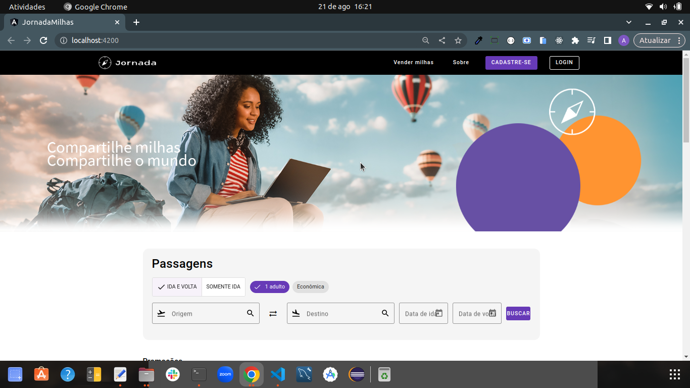

# Sobre o projeto

Esse, projeto foi desenvolvido durante o curso de Angular da <a href="https://www.alura.com.br/" target="_blank">Alura</a>.

## Descrição:

A empresa <strong>`Jornada Milhas`</strong>, é uma plataforma de venda de passagens aéreas, onde o desafio é desenvolver o layout fornecido pela a equipe de design da empresa, junto com a `API` que foi fornecida pelo time de Back-end. 

<strong>`1º Etapa:`</strong> Foi conhecer a componentização do `Angular`, criando componentes reutilizáveis e organizando a aplicação, e utilizamos o `Angular Material` para criar interfaces modernas, com sua ampla variedade de componentes disponíveis.  <strong>`2º Etapa:`</strong> Foi focar em controlar e validar formulários no Angular utilizando `serviços`, `APIs` e utilizar técnicas avançadas do Angular, como o `providedIn` e o `cache` com `shareReplay`. 
<strong>`3º Etapa:`</strong> Implementamos as telas de login e cadastro de usuarios, para esse processo utilizamos a biblioteca `JWT` (Json Web Token) para a autenticação de usuários e como proteger as rotas com a `Guarda de Rotas Funcional`.

## Tecnologias usadas no projeto:

- <strong>`Html`</strong>, <strong>`Css`</strong>, <strong>`TypeScript`</strong>, <strong>`Angular`</strong>

## `Instruções para executar o projeto na sua maquina:`

Abra seu terminal do Desktop e execute os passos abaixo:

- Clone o repositório com a chave SSH.
  - `git clone git@github.com:andrelucca99/jornada-milhas.git`
- Entre na pasta do repositório que você acabou de clonar:
  - `cd jornada-milhas`
- Instale as dependências do projeto:

  - `npm install`

- Abrar em um editor de texto de sua preferência e execute os comandos a seguir, um em cada terminal:

  - <strong>Para rodar o Front-end da aplicação :</strong> `ng serve -open`

  - <strong>Para subir à API da aplicação :</strong> 
    - Entre na pasta <strong>`api-jornada-milhas`</strong>.  
    - Rode o comando: <strong>`npm install`</strong>
      para installar às dependências. 
    - Execute o comando: <strong>`npm start`</strong> para subir a Api.
